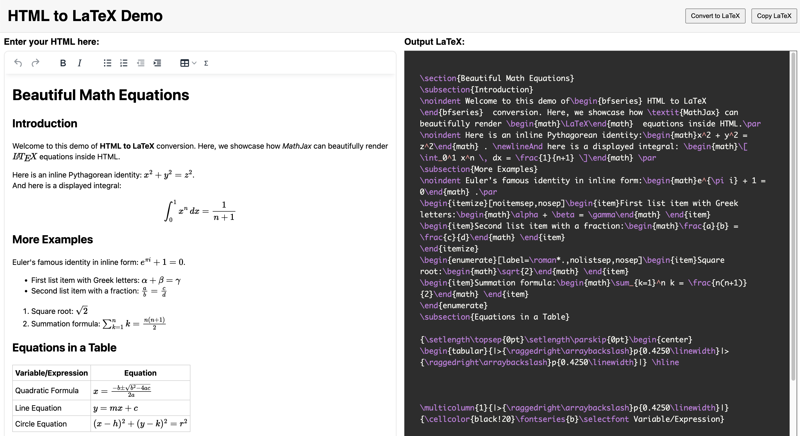

# HTML2LaTeX


Originally a **Python 2.7** library to convert HTML (generated by rich text editors like TinyMCE/CKEditor) into LaTeX markup. It is now being modernized for **Python 3**. The initial version was developed between **2014** and **2016** as part of a publishing workflow for educational content.

> **Note**: This project is being actively modernized for **Python 3** (primary target: **Python 3.14.x**, minimum **3.10**). Some legacy behavior remains while the migration is in progress.

## Table of Contents

1. [Background](#background)
2. [Screenshots](#screenshots)
3. [Features & Caveats](#features--caveats)
4. [Requirements](#requirements)
5. [Quick Start](#quick-start)
6. [Usage](#usage)
7. [Future Plans](#future-plans)
8. [License](#license)

---

## Background

Content teams authored study materials in a web-based rich text editor (e.g., TinyMCE). We needed to reliably convert the HTML output of these editors into **LaTeX** to generate PDFs for printing.

**HTML2LaTeX** was built as an internal component in that publishing pipeline. It handles table formatting, math equations (via custom parsing for MathJax-like syntax), image handling, and more—albeit in a very **domain-specific** way.

---

## Screenshots



---

## Features & Caveats

- **Features**:
  - Converts basic HTML elements (`<p>`, `<div>`, `<span>`, ``, `<table>`, `<ul>`, `<ol>`, etc.) to LaTeX equivalents.
  - Custom handling of math equations wrapped in `<span class="math-tex">` or similar.
  - Handles table merges, cell spans, image scaling, etc.
  - Rudimentary caching (now delegated to the calling application).
  - Allows some fancy replacements for `ü` → `\checkmark` and other domain-specific behavior.

- **Caveats**:
  1. Legacy Python 2.7 assumptions still exist, but modernization to Python 3 is in progress.
  2. Last major code changes were done **in 2016**, so many parts may be outdated or fragile.
  3. **Heavily customized** for historical internal workflows. Some legacy behavior may still surface.
  4. Some legacy table rendering paths reference deprecated tools; these are being phased out.
  5. No longer actively maintained in its present form. Use at your own risk or fork and modernize.

---

## Requirements

- **Python 3.10+** (primary target: latest stable 3.14.x)
- Dependencies managed via `uv` and `pyproject.toml`
- Spellcheck is optional: install the `spellcheck` extra and ensure the system `enchant` library is available.

---

## Quick Start

1. **Clone** the repository:

   ```bash
   git clone https://github.com/pankaj28843/html2latex.git
   cd html2latex
   ```

2. **Install dependencies** (Python 3.10+):

   ```bash
   uv sync
   ```

   Optional (spellcheck support):

   ```bash
   uv sync --extra spellcheck
   ```

3. **Install** HTML2LaTeX (in “editable” mode):

   ```bash
   uv sync
   ```

4. **Run** a simple test:

   ```bash
   uv run python -c "from html2latex import html2latex; print(html2latex('<p>Hello World</p>'))"
   ```

   This should output some LaTeX snippet like `\noindent Hello World \par`.

---

## Usage

In your **Python 3** code:

```python
from html2latex.html2latex import html2latex

html_string = """
<p>Hello <b>World</b></p>
<p>This is a test with a math equation: <span class="math-tex">\( x^2 + y^2 = z^2 \)</span></p>
"""

latex_code = html2latex(html_string)
print(latex_code)
```

- If you integrate it into a larger codebase, you can handle caching, logging, or environment variables at the application layer.

---

## Docker & Demo App

We provide a **demo Flask app** that showcases HTML-to-LaTeX conversion, including a small frontend with a rich text editor and a right-pane preview of the converted LaTeX.

1. **Build** and **run** via Docker Compose:

   ```bash
   docker compose build
   docker compose up
   ```

2. Go to <http://127.0.0.1:15005/> to see the demo in action.

---

## CI

CI runs on GitHub Actions and executes `ruff` (lint + format) and `pytest` across the supported Python matrix. The workflow lives in `.github/workflows/ci.yml`.

---

## Future Plans

- **Python 3 compatibility**: In progress (primary runtime: Python 3.14.x).
- **Modular design**: Reduce the domain-specific logic (like weird text replacements) and make it a more generic HTML-to-LaTeX converter.
- **Comprehensive test suite**: The code has mostly been tested in production, but lacks thorough automated tests.

## Modernization Plan (Active)

We are actively modernizing this project to Python 3, replacing `lxml` with `justhtml`, and adopting `uv`, `ruff`, and `pytest`.

- Python version policy (planned): primary runtime Python 3.14.x, minimum supported Python 3.10 (justhtml requirement).
- Full backlog + execution plan: `docs/modernization-backlog.md`
- Issue tracker (ordered): https://github.com/pankaj28843/html2latex/issues/20 through https://github.com/pankaj28843/html2latex/issues/37

---

## License

This project is licensed under the MIT License - see the [LICENSE](LICENSE) file for details.
